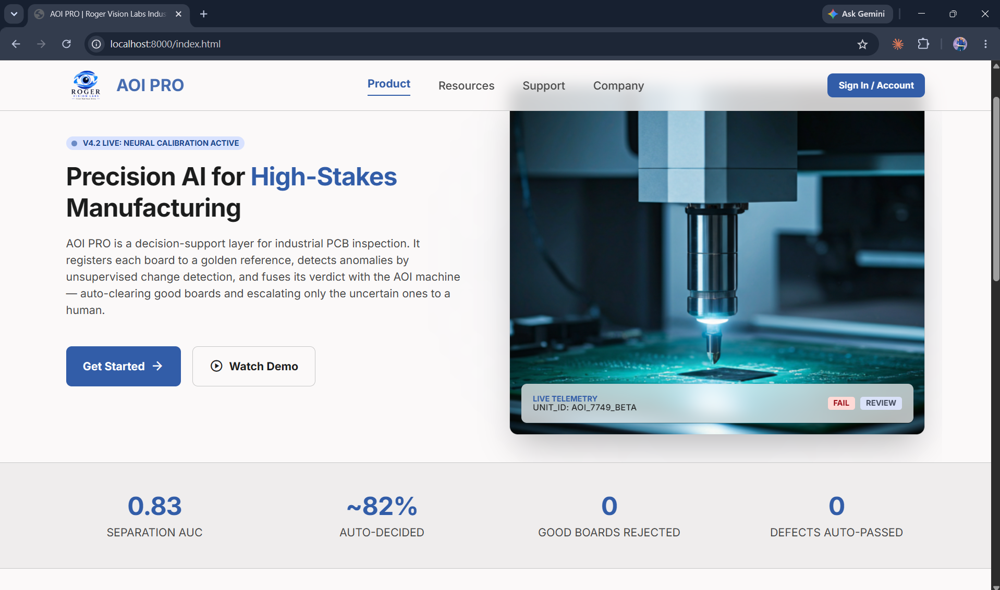
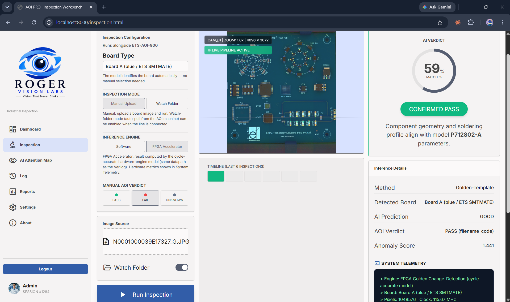
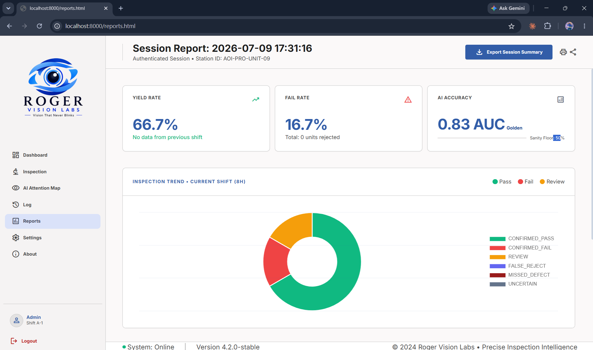
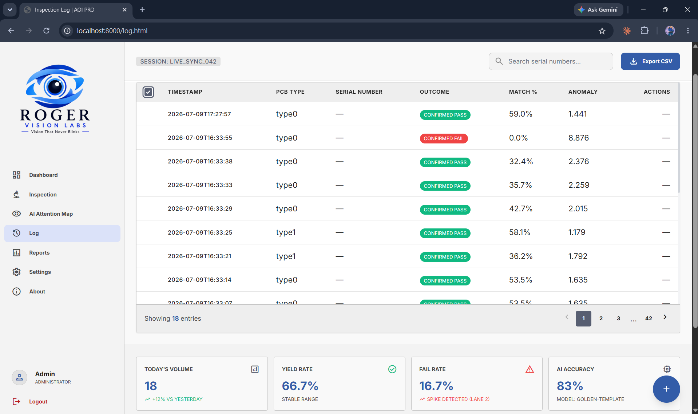
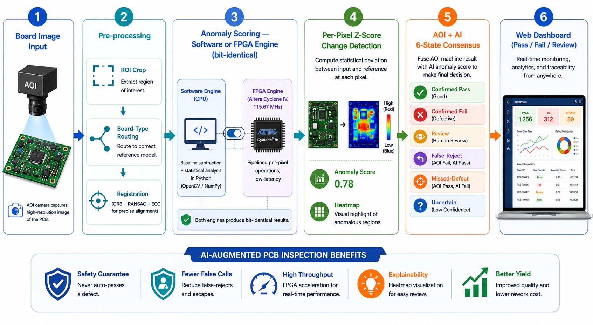
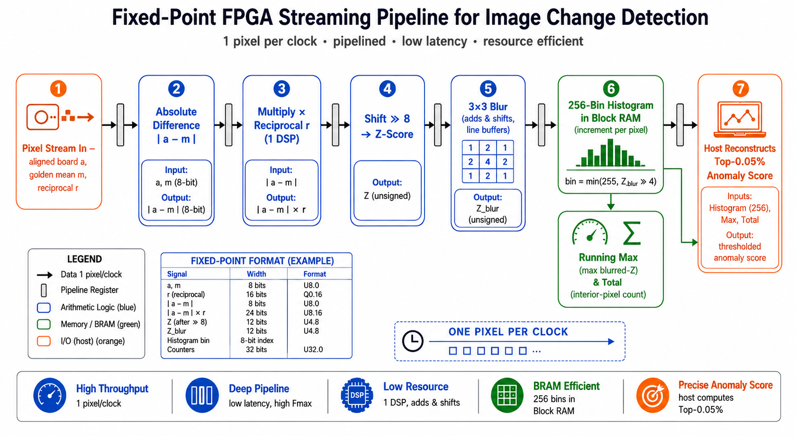
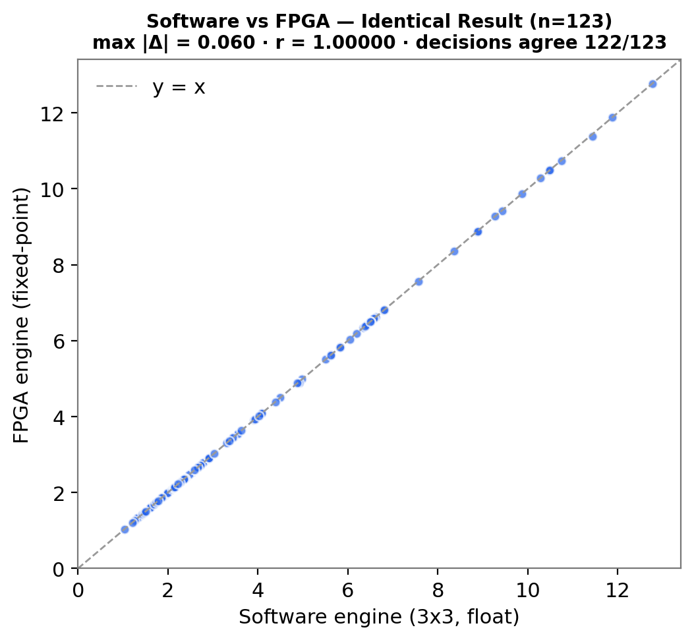
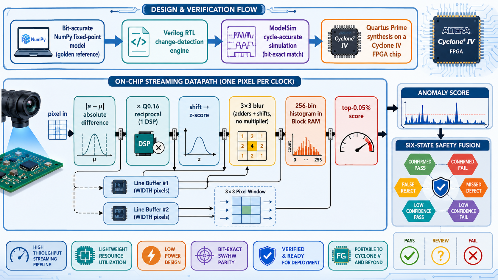

# 🔍 AOI PRO — AI-Augmented PCB Optical Inspection

**A golden-template decision-support system for PCB inspection, backed by a bit-exact FPGA change-detection accelerator.**


> 🌐 **Live demo:** _replace this line with your deployed URL after Step 6 below_
> &nbsp;&nbsp; 📄 Paper + thesis available on request · 🎓 M.Tech VLSI Design project

<p align="center">
  
</p>

---

## ✨ What it does

Factory **Automated Optical Inspection (AOI)** machines over-flag good boards, forcing operators to re-check huge numbers of false alarms — while never being allowed to miss a real defect. **AOI PRO** is an AI decision-support layer that sits beside the AOI machine: it **agrees with the machine on the easy boards and escalates only the genuinely uncertain ones to a human**, and its scoring engine is implemented **bit-exactly on an FPGA** for real-time, low-power operation.

### 🏆 Highlights

| Metric | Result |
|---|---|
| 🎯 Separation AUC | **0.83** (95% CI 0.69–0.94) |
| ✅ Boards auto-passed | **~86%** |
| 🧑‍🔧 Manual review reduced | **~39%** |
| 🛡️ Defects auto-passed (safety) | **0** |
| ⚡ FPGA throughput | **1 pixel / clock @ 115.67 MHz** |
| 🔋 FPGA core power (Cyclone V) | **13.2 mW** |
| 🎛️ Software ↔ FPGA agreement | **99.2% (122/123)**, max diff **0.06**, r **1.0000** |

---

## 🖥️ The web application

A single FastAPI service serves both the inspection API and the operator dashboard — no GPU required (pure OpenCV + NumPy).

| Inspection | Reports | Log |
|---|---|---|
|  |  |  |

**The six-state decision** fuses the AOI machine verdict with the AI verdict:
`CONFIRMED_PASS` · `CONFIRMED_FAIL` · `FALSE_REJECT` · `MISSED_DEFECT` · `REVIEW` · `UNCERTAIN`.
Only mutual *good* auto-passes; anything else goes to a human — so **no defect is ever auto-passed**.

---

## 🧠 How it works

<p align="center">
  
</p>

1. **Register** the board to a *golden template* — ORB feature matching → RANSAC homography → ECC sub-pixel refinement.
2. **Change-detect** — per-pixel z-score `z = |board − μ| / (σ + k)` against the golden statistics.
3. **Score** — aggregate the **top-ρ** (0.05%) most anomalous pixels (defects are small & local).
4. **Route** — a gallery of per-type goldens; each board is matched to its design type.
5. **Fuse** — six-state consensus of AOI + AI → auto-pass or escalate to a human.
6. **Calibrate** — thresholds from a high quantile of good-board scores (formalised as split-conformal calibration in the paper).

---

## ⚡ FPGA change-detection accelerator (the VLSI core)

The scoring engine is implemented as a **fully-streaming, bit-exact** hardware datapath — one pixel per clock, division replaced by a single `multiply + shift` (one DSP).

<p align="center">
  
  
</p>

| Target device | Logic | Registers | DSP | Fmax | Power |
|---|---|---|---|---|---|
| **Cyclone IV E** (EP4CE115F29C7) | 823 LE | 661 | 2 | **115.67 MHz** | 204.7 mW |
| Cyclone IV E + AXI IP wrapper | 838 LE | — | 2 | 89.81 MHz | — |
| **Cyclone V** (5CSEMA5F31C6) | 309 ALM | 745 | 1 | 71.29 MHz | **13.2 mW** |

> **Bit-exact verification:** across the test boards, software (float) and FPGA (fixed-point) scores differ by at most **0.06** with correlation **1.0000**, and **122 of 123** pass/fail decisions agree (99.2%) — the one difference being a board sitting right on its threshold.

<p align="center">
  
</p>

---

## 🚀 Run it locally

```bash
# 1. clone
git clone https://github.com/<your-username>/pcb-ai-augmented-aoi.git
cd pcb-ai-augmented-aoi

# 2. install (CPU-only, no GPU)
pip install -r requirements.txt

# 3. run
cd app/backend
python -m uvicorn app:app --host 127.0.0.1 --port 8000
```

Then open **http://localhost:8000** in your browser.

---

## ☁️ Deploy a live demo (free)

**Option A — Render (recommended, easiest):**
1. Push this repo to GitHub.
2. Go to [render.com](https://render.com) → **New → Web Service** → connect this repo.
3. Render detects the `Dockerfile` automatically → **Create Web Service**.
4. Your live URL appears (e.g. `https://pcb-ai-aoi.onrender.com`). Paste it at the top of this README.

**Option B — Hugging Face Spaces:**
1. Create a **Space** → SDK: **Docker**.
2. Push this repo to the Space; it builds from the `Dockerfile` (port 7860).
3. Your URL: `https://huggingface.co/spaces/<your-username>/aoi-pro`.

> ⏳ Free tiers sleep when idle — the first visit may take ~30–60 s to wake up.

---

## 📂 Repository structure

```
pcb-ai-augmented-aoi/
├── app/
│   ├── backend/        FastAPI server + web UI (frontend/)
│   ├── golden/         golden-template engine + trained gallery (*.npz)
│   ├── roi/            board cropping / ROI detection
│   └── fpga/           fixed-point hardware emulator (software↔FPGA parity)
├── docs/images/        figures & screenshots
├── Dockerfile          one-file deploy (Render / HF Spaces / any Docker host)
├── requirements.txt    CPU-only runtime dependencies
└── LICENSE             MIT
```

---

## 🛠️ Tech stack

**Backend:** Python · FastAPI · Uvicorn · OpenCV · NumPy
**Hardware:** Verilog RTL · Intel Quartus Prime · ModelSim · Cyclone IV E / Cyclone V · AXI4
**Methods:** golden-template registration · per-pixel z-score change detection · top-ρ aggregation · six-state AOI+AI fusion · split-conformal calibration · fixed-point (Q0.16) datapath

---

## 👤 Author

**Paul Rojer R.** — M.Tech VLSI Design, SASTRA Deemed University
📫 karry.29paul@gmail.com

*Developed at the BEST Centre EMS Lab. Released under the MIT License.*
